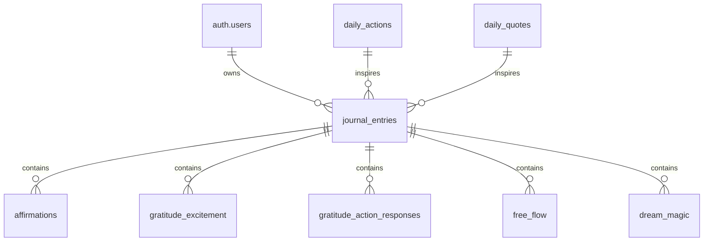
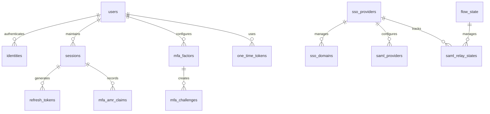

# Database Documentation

## Table of Contents

1. [Schema Overview](#schema-overview)
2. [Core Tables](#core-tables)
   - [journal_entries](#journal_entries)
   - [affirmations](#affirmations)
   - [gratitude_excitement](#gratitude_excitement)
   - [gratitude_action_responses](#gratitude_action_responses)
   - [free_flow](#free_flow)
   - [dream_magic](#dream_magic)
3. [Authentication Tables](#authentication-tables)
   - [flow_state](#flow_state)
   - [one_time_tokens](#one_time_tokens)
4. [System Tables](#system-tables)
   - [instances](#instances)
   - [schema_migrations](#schema_migrations)
5. [Database Functions](#database-functions)
   - [Journal Entry Functions](#journal-entry-functions)
   - [Triggers](#triggers)
6. [Performance Considerations](#performance-considerations)
7. [Development Notes](#development-notes)
   - [Type Safety](#type-safety)
   - [Mock Data](#mock-data)

## Schema Overview

### Application Schemas
- `public`: Main application schema (owner: pg_database_owner)
  - Contains all application-specific tables and views
  - Stores journal entries and related data

- `auth`: Authentication schema (owner: supabase_admin)
  - Managed by Supabase
  - Handles user authentication and authorization
  - Referenced by public.journal_entries.user_id

### Supabase Service Schemas
- `storage`: File storage service (owner: supabase_admin)
- `realtime`: Real-time subscriptions service (owner: supabase_admin)
- `graphql`: GraphQL service (owner: supabase_admin)
- `graphql_public`: Public GraphQL interface (owner: supabase_admin)

### System Schemas
- `extensions`: PostgreSQL extensions (owner: postgres)
- `pgbouncer`: Connection pooling (owner: pgbouncer)
- `pgsodium`: Encryption features (owner: supabase_admin)
- `vault`: Secrets management (owner: supabase_admin)

## Database Relationships

### Entity Relationship Diagrams

#### Application Schema


#### Auth Schema


## Tables and Views

### Public Schema

#### Core Tables

##### journal_entries
**Description**: Core table tracking user's daily journal entries and points progression on their growth journey. Users start at Base Camp (0 points) and progress through milestones: First Rest (50 pts), Halfway Point (100 pts), Final Push (200 pts), and Summit (300 pts).

**Schema**:
```sql
CREATE TABLE journal_entries (
  id UUID NOT NULL PRIMARY KEY,
  user_id UUID REFERENCES auth.users,
  date DATE NOT NULL,
  morning_completed BOOLEAN,
  morning_mood_score INTEGER,
  morning_mood_factors TEXT[],
  morning_reflection TEXT,
  morning_points INTEGER,
  evening_completed BOOLEAN,
  evening_mood_score INTEGER,
  evening_mood_factors TEXT[],
  evening_reflection TEXT,
  evening_points INTEGER,
  gratitude_action_completed BOOLEAN,
  gratitude_action_points INTEGER,
  total_points INTEGER,
  created_at TIMESTAMPTZ,
  updated_at TIMESTAMPTZ
);
```

**Column Details**:
- `user_id` - Reference to auth.users. Each user starts at Base Camp (0 points) and progresses through milestones.
- `date` - Date of the journal entry. One entry per user per day, tracking streak for consistent journaling.
- `morning_completed` - Tracks completion of morning journal activities: mood (1-10), reflection, 5 affirmations, 3 gratitude items, 3 excitement items.
- `morning_points` - Points earned from completing morning journal activities (+5 points).
- `evening_completed` - Tracks completion of evening journal activities: mood check, day reflection, tomorrow's plans.
- `evening_points` - Points earned from completing evening journal activities (+5 points).
- `gratitude_action_completed` - Tracks completion of daily gratitude action task and reflection.
- `gratitude_action_points` - Points earned from completing the daily gratitude action (+10 points).
- `total_points` - Total points earned for this day. Progress milestones: Base Camp (0), First Rest (50), Halfway Point (100), Final Push (200), Summit (300).

**Indexes**:
- `journal_entries_pkey`: Primary key index on `id`
- `journal_entries_user_id_date_key`: Unique index on `(user_id, date)` - Ensures one entry per user per day
- `idx_journal_entries_user_date`: Performance index on `(user_id, date)` - Optimizes user's date range queries

#### Journal Component Tables

##### affirmations
**Description**: Daily affirmations (5 required) as part of the morning journal flow.

**Indexes**:
- `affirmations_pkey`: Primary key index on `id`
- `idx_affirmations_journal`: Performance index on `journal_entry_id`

##### gratitude_excitement
**Description**: Tracks 3 gratitude items and 3 excitement items from morning journal.

**Indexes**:
- `gratitude_excitement_pkey`: Primary key index on `id`
- `idx_gratitude_excitement_entry`: Performance index on `journal_entry_id`

##### gratitude_action_responses
**Description**: User reflections on completing their daily gratitude action task.

**Indexes**:
- `gratitude_action_responses_pkey`: Primary key index on `id`
- `idx_gratitude_responses_entry`: Performance index on `journal_entry_id`

##### free_flow
**Description**: Free-form journal entries for morning and evening reflections.

**Indexes**:
- `free_flow_pkey`: Primary key index on `id`
- `idx_free_flow_entry`: Performance index on `journal_entry_id`

##### dream_magic
**Description**: Dream journaling component for tracking and reflecting on dreams.

**Indexes**:
- `dream_magic_pkey`: Primary key index on `id`
- `idx_dream_magic_entry`: Performance index on `journal_entry_id`

#### Daily Content Tables

##### daily_actions
**Description**: Daily gratitude actions that contribute to the user's growth and point accumulation. Each day has one unique gratitude action task.

**Indexes**:
- `daily_actions_pkey`: Primary key index on `id`
- `daily_actions_active_date_key`: Unique index on `active_date`

##### daily_quotes
**Description**: Daily inspiration cards that set the tone for the user's journey each day. Each day has one unique inspirational quote.

**Indexes**:
- `daily_quotes_pkey`: Primary key index on `id`
- `daily_quotes_active_date_key`: Unique index on `active_date`

#### Views

##### leaderboard
**Description**: Aggregated view showing user rankings and achievements. Displays total points, streak count, and days journaled for all onboarded users.

**Definition**:
```sql
WITH user_stats AS (
  SELECT 
    journal_entries.user_id,
    count(DISTINCT journal_entries.date) AS days_journaled,
    sum(journal_entries.total_points) AS calculated_points
  FROM journal_entries
  GROUP BY journal_entries.user_id
)
SELECT 
  u.id,
  COALESCE(u.raw_user_meta_data->>'name', 'Anonymous User') AS display_name,
  COALESCE(us.calculated_points, 0) AS total_points,
  COALESCE((u.raw_user_meta_data->>'streak_count')::integer, 0) AS streak_count,
  COALESCE(us.days_journaled, 0) AS days_journaled
FROM auth.users u
LEFT JOIN user_stats us ON u.id = us.user_id
WHERE u.raw_user_meta_data->>'onboarded' = 'true'
ORDER BY COALESCE(us.calculated_points, 0) DESC NULLS LAST;
```

**Performance Notes**:
- Uses a CTE to calculate user statistics once
- LEFT JOIN ensures all onboarded users appear
- Includes COALESCE to handle NULL values
- Ordered by points for efficient display

### Auth Schema

#### Authentication Tables

##### users
**Description**: Stores user login data within a secure schema.
- `is_sso_user` - Set this column to true when the account comes from SSO. These accounts can have duplicate emails.

##### identities
**Description**: Stores identities associated to a user.
- `email` - Generated column that references the optional email property in the identity_data.

##### sessions
**Description**: Stores session data associated to a user.
- `not_after` - Timestamp after which the session should be regarded as expired.

##### refresh_tokens
**Description**: Store of tokens used to refresh JWT tokens once they expire.

#### Multi-Factor Authentication Tables

##### mfa_factors
**Description**: Stores metadata about factors.

##### mfa_challenges
**Description**: Stores metadata about challenge requests made.

##### mfa_amr_claims
**Description**: Stores authenticator method reference claims for multi factor authentication.

#### Single Sign-On Tables

##### sso_providers
**Description**: Manages SSO identity provider information.
- `resource_id` - Uniquely identifies a SSO provider according to a user-chosen resource ID.

##### sso_domains
**Description**: Manages SSO email address domain mapping to an SSO Identity Provider.

##### saml_providers
**Description**: Manages SAML Identity Provider connections.

##### saml_relay_states
**Description**: Contains SAML Relay State information for each Service Provider initiated login.

#### Security and Audit Tables

##### audit_log_entries
**Description**: Audit trail for user actions.

##### flow_state
**Description**: Stores metadata for PKCE logins.

##### one_time_tokens
**Description**: Single-use tokens for various authentication purposes.

#### System Tables

##### instances
**Description**: Manages users across multiple sites.

##### schema_migrations
**Description**: Manages updates to the auth system.


### Database Functions

#### Journal Entry Functions

```sql
-- Complete Morning Entry
CREATE OR REPLACE FUNCTION public.complete_morning_entry(entry_id uuid)
RETURNS void
LANGUAGE plpgsql
SECURITY DEFINER
SET search_path TO 'public'
AS $$
BEGIN
    -- Update points
    PERFORM update_journal_points(entry_id);
    -- Update streak
    PERFORM update_user_streak(auth.uid());
END;
$$;

-- Complete Evening Entry
CREATE OR REPLACE FUNCTION public.complete_evening_entry(entry_id uuid, tomorrow_plan text)
RETURNS void
LANGUAGE plpgsql
AS $$
DECLARE
  current_points INTEGER;
  current_streak INTEGER;
BEGIN
  -- Verify the entry exists and evening section is complete
  IF NOT is_evening_complete(entry_id) THEN
    RAISE EXCEPTION 'Evening section is not complete';
  END IF;

  -- Update tomorrow's plan and points
  UPDATE journal_entries
  SET tomorrow_plan = $2,
      evening_points = 5
  WHERE id = entry_id;

  -- Get current points and streak
  SELECT total_points, streak_count
  INTO current_points, current_streak
  FROM journal_entries
  WHERE id = entry_id;

  -- Update total points
  UPDATE journal_entries
  SET total_points = current_points + 5
  WHERE id = entry_id;

  -- Update user metadata
  UPDATE auth.users
  SET raw_user_meta_data = jsonb_set(
    COALESCE(raw_user_meta_data, '{}'::jsonb),
    '{total_points}',
    to_jsonb(current_points + 5)
  )
  WHERE id = (
    SELECT user_id 
    FROM journal_entries 
    WHERE id = entry_id
  );
END;
$$;

-- Complete Gratitude Action
CREATE OR REPLACE FUNCTION public.complete_gratitude_action(entry_id uuid)
RETURNS void
LANGUAGE plpgsql
SECURITY DEFINER
SET search_path TO 'public'
AS $$
BEGIN
    -- Update points
    PERFORM update_journal_points(entry_id);
END;
$$;

-- Update Journal Points
CREATE OR REPLACE FUNCTION public.update_journal_points(entry_id uuid)
RETURNS void
LANGUAGE plpgsql
SECURITY DEFINER
SET search_path TO 'public'
AS $$
DECLARE
    morning_complete BOOLEAN;
    evening_complete BOOLEAN;
    action_complete BOOLEAN;
    user_id UUID;
BEGIN
    -- Get user_id for this entry
    SELECT journal_entries.user_id INTO user_id
    FROM journal_entries
    WHERE journal_entries.id = entry_id;

    -- Only proceed if the user owns this entry
    IF user_id = auth.uid() THEN
        morning_complete := is_morning_complete(entry_id);
        evening_complete := is_evening_complete(entry_id);
        
        SELECT action_completed INTO action_complete
        FROM gratitude_action_responses
        WHERE journal_entry_id = entry_id;

        -- Update points
        UPDATE journal_entries
        SET 
            morning_points = CASE WHEN morning_complete THEN 5 ELSE 0 END,
            evening_points = CASE WHEN evening_complete THEN 5 ELSE 0 END,
            gratitude_action_points = CASE WHEN action_complete THEN 10 ELSE 0 END
        WHERE id = entry_id;

        -- Update user's total points
        UPDATE auth.users 
        SET raw_user_meta_data = jsonb_set(
            COALESCE(raw_user_meta_data, '{}'::jsonb),
            '{total_points}',
            (
                SELECT to_jsonb(COALESCE(SUM(total_points), 0))
                FROM journal_entries
                WHERE user_id = auth.uid()
            )
        )
        WHERE id = auth.uid();
    END IF;
END;
$$;

-- Update User Streak
CREATE OR REPLACE FUNCTION public.update_user_streak(user_id uuid)
RETURNS void
LANGUAGE plpgsql
SECURITY DEFINER
SET search_path TO 'public'
AS $$
DECLARE
    last_entry_date DATE;
    current_streak INTEGER;
    latest_entry_date DATE;
BEGIN
    -- Only proceed if this is the user's own streak
    IF user_id = auth.uid() THEN
        -- Get the user's latest entry date
        SELECT date INTO latest_entry_date
        FROM journal_entries
        WHERE user_id = auth.uid()
        ORDER BY date DESC
        LIMIT 1;

        -- Get the previous entry date
        SELECT date INTO last_entry_date
        FROM journal_entries
        WHERE user_id = auth.uid()
        AND date < latest_entry_date
        ORDER BY date DESC
        LIMIT 1;

        -- Get current streak
        SELECT streak_count INTO current_streak
        FROM auth.users
        WHERE id = auth.uid();

        -- Update streak based on entry dates
        IF last_entry_date IS NULL OR latest_entry_date = last_entry_date + INTERVAL '1 day' THEN
            -- First entry or consecutive day
            UPDATE auth.users 
            SET streak_count = COALESCE(current_streak, 0) + 1
            WHERE id = auth.uid();
        ELSIF latest_entry_date > last_entry_date + INTERVAL '1 day' THEN
            -- Streak broken
            UPDATE auth.users 
            SET streak_count = 1
            WHERE id = auth.uid();
        END IF;
    END IF;
END;
$$;

-- Check if Morning Entry is Complete
CREATE OR REPLACE FUNCTION public.is_morning_complete(journal_entry_id uuid)
RETURNS boolean
LANGUAGE plpgsql
AS $$
DECLARE
    morning_affirmation_count INTEGER;
    gratitude_count INTEGER;
    excitement_count INTEGER;
BEGIN
    -- Check main morning fields
    IF NOT EXISTS (
        SELECT 1 FROM journal_entries 
        WHERE id = journal_entry_id 
        AND morning_mood_score IS NOT NULL
        AND morning_mood_factors IS NOT NULL
        AND morning_reflection IS NOT NULL
    ) THEN
        RETURN FALSE;
    END IF;

    -- Check affirmations (need all 5)
    SELECT COUNT(*) INTO morning_affirmation_count
    FROM affirmations
    WHERE journal_entry_id = journal_entry_id;
    
    -- Check gratitude items (need all 3)
    SELECT COUNT(*) INTO gratitude_count
    FROM gratitude_excitement
    WHERE journal_entry_id = journal_entry_id AND type = 'gratitude';
    
    -- Check excitement items (need all 3)
    SELECT COUNT(*) INTO excitement_count
    FROM gratitude_excitement
    WHERE journal_entry_id = journal_entry_id AND type = 'excitement';
    
    RETURN morning_affirmation_count >= 5 
        AND gratitude_count >= 3 
        AND excitement_count >= 3;
END;
$$;

-- Check if Evening Entry is Complete
CREATE OR REPLACE FUNCTION public.is_evening_complete(journal_entry_id uuid)
RETURNS boolean
LANGUAGE plpgsql
AS $$
BEGIN
    RETURN EXISTS (
        SELECT 1 FROM journal_entries 
        WHERE id = journal_entry_id 
        AND evening_mood_score IS NOT NULL
        AND evening_mood_factors IS NOT NULL
        AND evening_reflection IS NOT NULL
    );
END;
$$;

-- Update Updated At Column
CREATE OR REPLACE FUNCTION public.update_updated_at_column()
RETURNS trigger
LANGUAGE plpgsql
AS $$
BEGIN
    NEW.updated_at = CURRENT_TIMESTAMP;
    RETURN NEW;
END;
$$;
```

#### Triggers

```sql
-- Update Updated At Trigger
CREATE TRIGGER update_updated_at_timestamp
    BEFORE UPDATE ON journal_entries
    FOR EACH ROW
    EXECUTE FUNCTION update_updated_at_column();

-- Update Points Trigger
CREATE TRIGGER update_points_after_changes
    AFTER INSERT OR UPDATE ON journal_entries
    FOR EACH ROW
    EXECUTE FUNCTION update_journal_points();
```

## Performance Considerations

- All foreign key relationships are indexed for efficient joins
- Composite index on `(user_id, date)` optimizes date range queries
- Unique constraints prevent duplicate entries
- B-tree indexes used throughout for efficient queries

## Development Notes

### Type Safety
All database interactions are typed using generated TypeScript definitions in `lib/database.types.ts`.

### Mock Data
Development environment uses mock data implemented in `lib/supabase-client.ts`. 